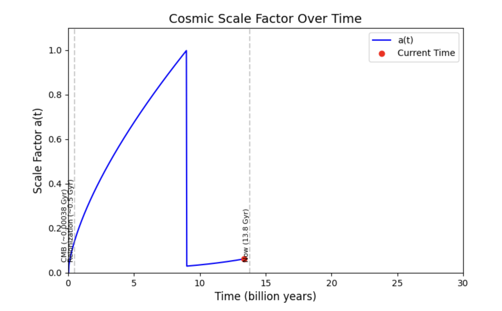

# Cosmic Scale Factor Simulation

This simulation models the evolution of the **cosmic scale factor a(t)** over time based on the standard ΛCDM model. It helps visualize how the universe expands from the Big Bang to the present epoch, showing key phases like radiation domination, matter domination, and dark energy domination.

## 📈 Output

- The graph shows **a(t)** (normalized to 1 today) vs **time in Gyr** (billion years).
- The curve peaks as the universe transitions from a slowing expansion to an accelerating phase due to dark energy.

## 🧠 Concepts Covered
- Friedmann Equation (qualitative)
- Radiation, Matter, and Dark Energy density contributions
- Cosmic time and scale factor normalization
- Expansion history from early universe to present day

## 🧰 Tools Used
- Python
- NumPy
- Matplotlib

## 📄 Files
- `Cosmic_Scale_Factor_Simulation.ipynb` — Main simulation notebook
- `Cosmic_Scale_Factor_Simulation.png` — Output graph
- `Expansion_of_Space_and_Time_Report.pdf` — Detailed explanation and graph interpretation

## 🚀 Future Plans
- Include redshift-to-scale factor conversion
- Simulate future predictions with ΛCDM and alternate models
- Animate the evolution of the scale factor

## 💡 Credits
This project is part of a self-directed study in cosmology and computational physics.

