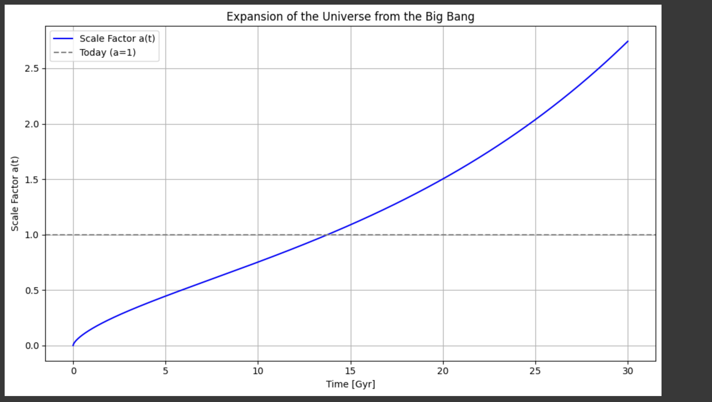

# 🌌 Universe Expansion Simulation — Flat ΛCDM Model

This project simulates the expansion of the universe from just after the Big Bang up to the far future using the standard cosmological model — the flat ΛCDM universe. It numerically solves the Friedmann equation to show how the **cosmic scale factor a(t)** evolves over time.

---

## 📊 Simulation Output



The plot shows how the universe expanded from an extremely small scale factor to an accelerated phase driven by dark energy. The present time corresponds to \( a(t) = 1 \), approximately 13.8 Gyr after the Big Bang.

---

## 🧠 Physics Behind the Simulation

We use the first Friedmann equation for a flat universe:

$$
(da/dt)^2 / a^2 = H0^2 [ Ω_r / a^4 + Ω_m / a^3 + Ω_Λ ]
$$

Where:
- $a(t)$: Scale factor of the universe  
-  $H_0$: Hubble constant (70 km/s/Mpc ≈ 0.070 Gyr⁻¹)  
-  $\Omega_r$: Radiation density ≈ 8.24×10⁻⁵  
-  $\Omega_m$ : Matter density ≈ 0.3  
-  $\Omega_\Lambda$ : Dark energy density ≈ 0.7  

The equation models the competing effects of radiation, matter, and dark energy on cosmic expansion.

---

## 🛠 Installation

### 1. Clone the Repository

```bash
git clone https://github.com/yourusername/universe-expansion-sim.git
cd universe-expansion-sim
```

### 2. Install Python Dependencies

```bash
pip install numpy scipy matplotlib
```

---

## ▶️ How to Run

Run the simulation:

```bash
python universe_expansion.py
```

It will generate and display a plot showing the evolution of the scale factor from ~0 Gyr to 30 Gyr and save it as:

```
Expansion_of_the_Universe_from_the_Big_Bang.png
```

---

## 📁 Project Structure

```
.
├── Expansion_of_the_Universe_from_the_Big_Bang.ipynb    # Python script for the simulation
├── Expansion_of_the_Universe_from_the_Big_Bang.png  # Generated plot
├── Expansion_of_the_Universe_from_the_Big_Bang.pdf   # LaTeX report with explanation
└── README.md                                      # This file
```

---

## 📈 What You’ll Learn from the Plot

- **Radiation era** (early universe): $a(t) \propto t^{1/2}$
- **Matter era** (intermediate times): $a(t) \propto t^{2/3}$
- **Dark energy era** (late times):  $a(t) \propto e^{Ht}$
- At  $t \approx 13.8 Gyr$,  $a(t) = 1$, matching the current age of the universe

---

## 📄 LaTeX Report

A scientific report `Expansion_of_the_Universe_from_the_Big_Bang.pdf` is included. It provides:
- Equations and theory
- Explanation of the numerical method
- Analysis of the simulation result
- Comparison with known cosmology

To compile the report, upload the PNG to Overleaf and compile `report.tex` using `pdflatex`.

---

## 📚 References

- Ryden, Barbara — *Introduction to Cosmology*  
- Planck Collaboration (ESA)  
- [ΛCDM Model - Wikipedia](https://en.wikipedia.org/wiki/Lambda-CDM_model)  
- NASA Cosmology Tutorial: https://map.gsfc.nasa.gov/universe/

---

## ✍️ Author

**Malladi Aditya Naga Srinadh**  
MSc Physics  
Aspiring data analyst with a love for cosmology and scientific simulation

---

## 📜 License

**MIT License** — Free to use, modify, and distribute.
