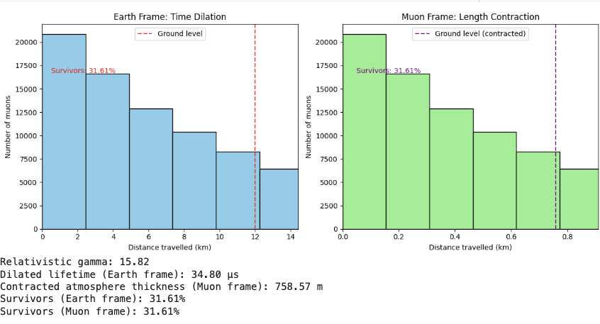

# Muon Time Dilation & Length Contraction Simulation

This project simulates how **special relativity** explains the survival of cosmic-ray muons traveling from the upper atmosphere to the Earth's surface.
It demonstrates **time dilation** (from the Earth's frame) and **length contraction** (from the muon's frame).

---

## 📜 Background

Cosmic-ray muons are produced about **10–15 km** above Earth.
In their rest frame, muons have a mean lifetime of only **2.2 μs**, meaning they should decay after traveling just \~600 meters at rest.

However, many are detected at ground level because:

* **From Earth's frame:** Muons’ clocks run slower (**time dilation**), extending their lifetime.
* **From the muon's frame:** The atmosphere is **length contracted**, so they have less distance to travel.

This matches real-world measurements, such as the **Cosmic Ray Muon Experiment**.

---

## 🧮 Physics Concepts Used

1. **Lorentz factor**
   $\gamma = \frac{1}{\sqrt{1 - \frac{v^2}{c^2}}}$

2. **Time dilation** (Earth frame):
   $t' = \gamma t_0$

3. **Length contraction** (Muon frame):
   $L' = \frac{L}{\gamma}$

4. **Decay probability**:
   $P_{\text{survive}} = e^{-t / \tau}$

---

## 📊 Example Output

Here’s an example plot comparing the distances muons travel before decaying in both frames:



---

## 📋 Parameters

| Parameter                 | Symbol | Default Value | Description                       |
| ------------------------- | ------ | ------------- | --------------------------------- |
| Muon velocity             | v      | 0.998 \* c    | Speed of muons                    |
| Muon rest lifetime        | τ₀     | 2.2 μs        | Mean proper lifetime              |
| Atmosphere thickness      | L      | 12,000 m      | Distance to ground in Earth frame |
| Number of simulated muons | N      | 100,000       | Total particles simulated         |

---

## 🚀 How to Run

1. Install dependencies:

   ```bash
   pip install numpy matplotlib
   ```

2. Run the simulation:

   ```bash
   python muon_simulation.py
   ```

3. The simulation will:

   * Plot histograms for both Earth and Muon frames.
   * Print survival percentages in both frames.
   * Save an example plot (`example_plot.png`).

---

## 📚 References

* Rossi, B., & Hall, D. B. (1941). *Variation of the rate of decay of mesotrons with momentum*. Physical Review, 59(3), 223.
* Feynman, R. P. – *Six Not-So-Easy Pieces*
* Taylor, E. F., & Wheeler, J. A. – *Spacetime Physics*

---
