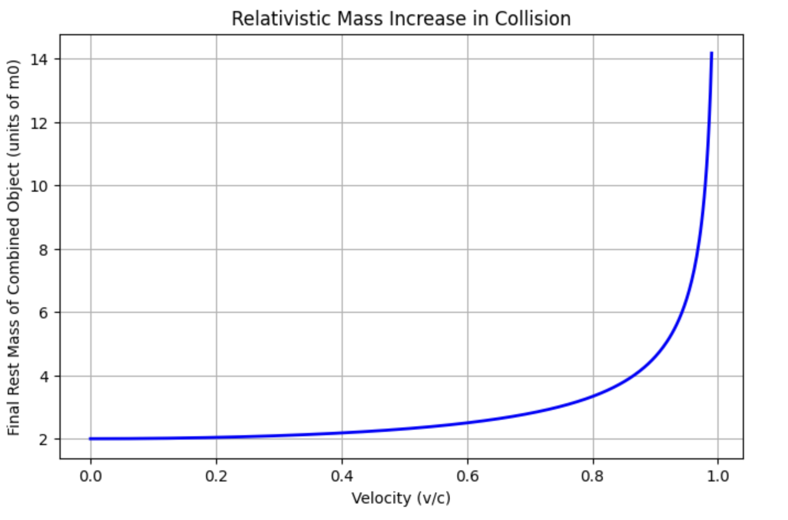

## Relativistic Collision Mass Increase

### Overview
This simulation demonstrates the relativistic effect of **mass increase due to kinetic energy**. Two identical particles, each with rest mass `m0`, move towards each other at a given velocity `v` and collide inelastically, coming to rest. The final rest mass of the combined object is greater than the sum of the original rest masses due to the conversion of kinetic energy into rest mass, as predicted by Einstein's mass-energy equivalence principle.

### Physics Behind the Simulation
In special relativity, the total energy of a particle is:

$$
E = \gamma m_0 c^2
$$

where:
-  $m_0$ is the rest mass of the particle,
-  $c$ is the speed of light,
-  $\gamma = \frac{1}{\sqrt{1 - (v/c)^2}}$ is the Lorentz factor, depending on the particle's velocity \( v \).

For two identical particles moving toward each other, the **total energy before collision** is:

$E_\text{total} = 2 \gamma m_0 c^2$

After an inelastic collision, the particles come to rest. The **total energy is conserved**, and now all the energy manifests as **rest energy** of the combined object:

$$
M_\text{final} = \frac{E_\text{total}}{c^2} = 2 \gamma m_0
$$

Notice that $M_\text{final} > 2 m_0$ for any non-zero velocity, meaning the combined object's rest mass has increased. This illustrates that **mass and energy are equivalent** and kinetic energy contributes to the total mass of a system.

### Simulation Details
- **Input:** Rest mass `m0` of each particle, range of velocities `v` (from 0 to 0.99c)  
- **Output:** Final rest mass of the combined object after collision  
- **Visualization:** Plot showing how the final rest mass increases with initial velocity  

---

## 📊 Example Output

Here’s an example plot showing how the final rest mass increases with initial particle velocity:

**Plot Caption:** The X-axis represents the fraction of light speed \( v/c \), and the Y-axis represents the final rest mass \( M_\text{final} \) in units of \( m_0 \). As velocity increases, relativistic effects increase the total rest mass beyond the classical sum.

---

## 📋 Parameters

| Parameter                | Symbol | Default Value | Description                                    |
| ------------------------ | ------ | ------------- | ---------------------------------------------- |
| Particle rest mass       | m₀     | 1 unit        | Rest mass of each particle                     |
| Particle velocity        | v      | 0–0.99 c      | Velocity of each particle towards the other   |
| Number of simulated steps| N      | 100           | Number of velocity samples for plotting       |

---

##📚 References

Feynman, R. P. – Six Not-So-Easy Pieces

Taylor, E. F., & Wheeler, J. A. – Spacetime Physics

Einstein, A. (1905). On the Electrodynamics of Moving Bodies
