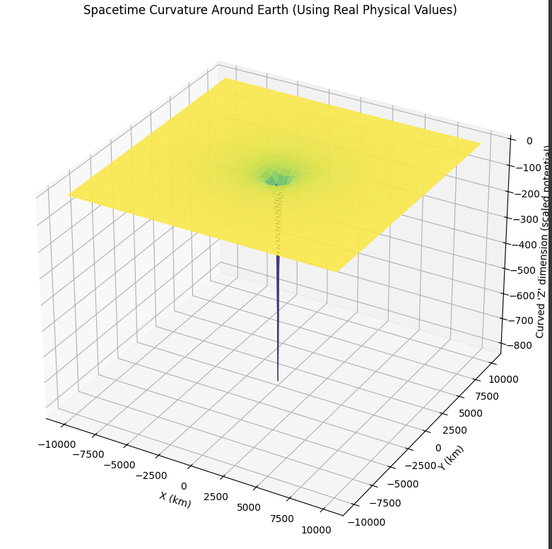
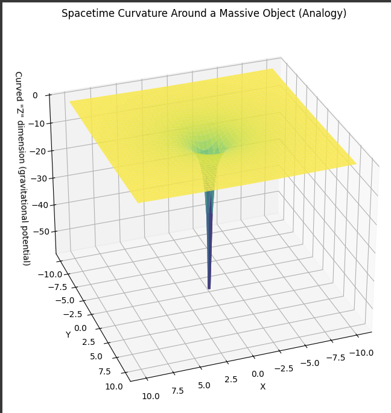

# Spacetime Curvature Around Earth (Exaggerated Visualization)

This simulation visualizes the curvature of spacetime around Earth using general relativity.  
Due to Earth's relatively low mass, the actual curvature is extremely subtle — effectively invisible at human scales.  
To help grasp the concept, the **vertical dimension is exaggerated** to reveal how spacetime deforms even around a low-mass object like Earth.

## What This Simulation Shows

- A 3D surface plot of spacetime curvature (as gravitational potential) around Earth.
- The plot exaggerates the curvature to make it visually understandable.
- This is a **visual analogy**, not a physical representation of the shape of space.
- It contrasts nicely with the sharper curvature of a **much more massive object** like a black hole.

## Why This Matters

- Even though Earth's curvature is nearly flat, it produces measurable time dilation (e.g. in GPS systems).
- Helps visualize how stronger gravitational fields (e.g. near a black hole) produce sharper curvatures.
- Good conceptual contrast for educational purposes.

## Simulation Tools

- **Python**
- **NumPy**
- **Matplotlib** (3D surface plotting)

## Outputs

### 🟢 Spacetime Curvature Around Earth (Exaggerated)

### ⚫ Spacetime Curvature Around a Massive Object (Black Hole Scale)

> **Note**: These are not literal 3D shapes of space, but plots of gravitational potential.  
> The shapes help intuitively convey **how mass warps spacetime**.

## Educational Value

- Demonstrates how general relativity predicts curvature for any mass.
- Makes weak-field curvature visible by exaggerating the effect.
- Great for classroom and self-learning contrast between Earth and extreme gravity cases.

---

**License**: MIT  
