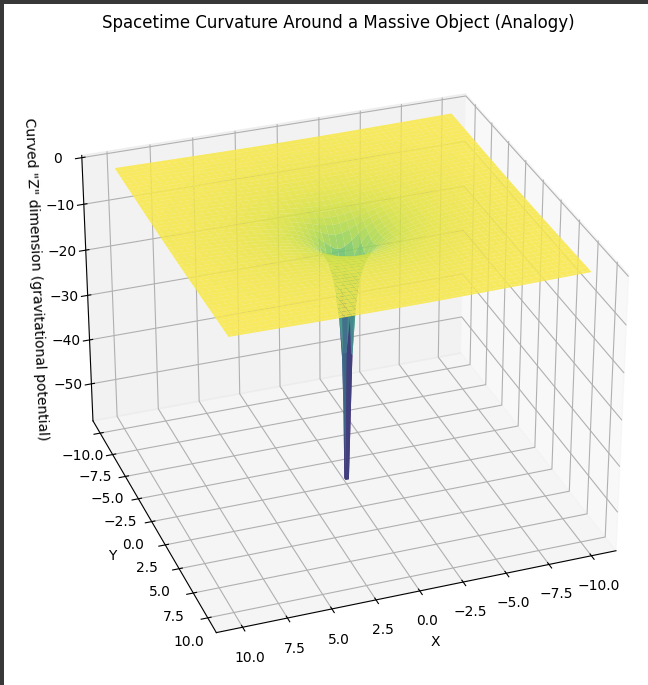

# Spacetime Curvature and Light Ray Bending Around a Massive Object

This simulation visually represents the curvature of spacetime around a massive object, along with the deflection of a passing light ray. It combines a warped coordinate grid to illustrate how gravity bends space, and traces how light (which travels along geodesics) is influenced by this curvature.

## Key Concepts

- **Spacetime curvature**: Mass tells spacetime how to curve. The grid shows how a massive object (like a star or black hole) distorts the surrounding space.
- **Geodesics**: In curved spacetime, free-falling objects (including light) follow paths called geodesics. Light rays are deflected as they pass near massive bodies.
- **Gravitational lensing**: This simulation provides a simplified model of how light bends around a mass, as observed in phenomena like Einstein rings.

## Features

- 2D warped grid showing spatial curvature
- Central massive object (Sun or black hole)
- A light ray path that bends near the mass
- Adjustable parameters to experiment with mass and light ray path (optional, depending on version)

## Tools Used

- Python
- NumPy
- Matplotlib

## Output

.png)

## Future Plans

- Animate the bending of multiple light rays
- Add interactive sliders to vary mass and initial light angle
- Extend to show time curvature and gravitational time dilation

## License

MIT License
