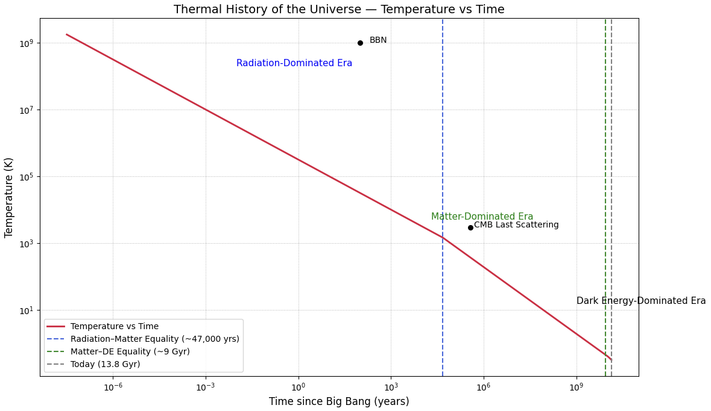

# Thermal History of the Universe — Temperature vs Time

This simulation visualizes the **cooling of the universe over cosmic time**, from the Big Bang to the present era. It uses well-established physical scaling laws to map **temperature vs. time** on a logarithmic scale, highlighting important epochs such as radiation domination, matter domination, and dark energy domination.

## Description

As the universe expands, it cools. This simulation assumes the temperature scales approximately as:

- $T \propto a^{-1}$ during radiation- and matter-dominated eras
- Time is related to the scale factor \( a \) using the Friedmann equations

We overlay critical cosmic events and transitions:

- **BBN (Big Bang Nucleosynthesis)**
- **CMB (Cosmic Microwave Background) Decoupling**
- **Radiation-Matter Equality (~47,000 years)**
- **Matter–Dark Energy Equality (~9 billion years)**
- **Today (13.8 billion years)**

The plot provides a clear visual timeline of how the universe cooled from  $\sim10^{10}$ K to the present-day 2.7 K.

## Plot



## How to Run

```bash
pip install numpy matplotlib
python thermal_history.py
```

## File Structure

- `Thermal_History_of_the_Universe_—_Temperature_vs_Time.ipynb`: Python script for generating the plot
- `Thermal_History_of_the_Universe_—_Temperature_vs_Time.png`: Output image of the simulation
- `README.md`: Project overview and explanation

## Physics Used

- Logarithmic temperature–time relationship during radiation-dominated era:  
 $T(t) \propto t^{-1/2}$
- Matter-dominated cooling:  
  $T(t) \propto t^{-2/3}$
- Transition points derived from observational cosmology (ΛCDM model)

## Notes

- This is a **data-based simulation**, not a purely visual analogy.
- Cosmic epochs are **plotted using observationally estimated times**.
- The **CMB and BBN markers** are approximate but grounded in real physics.

## License

MIT License

---

Feel free to fork, use, or adapt this for educational and research purposes.
