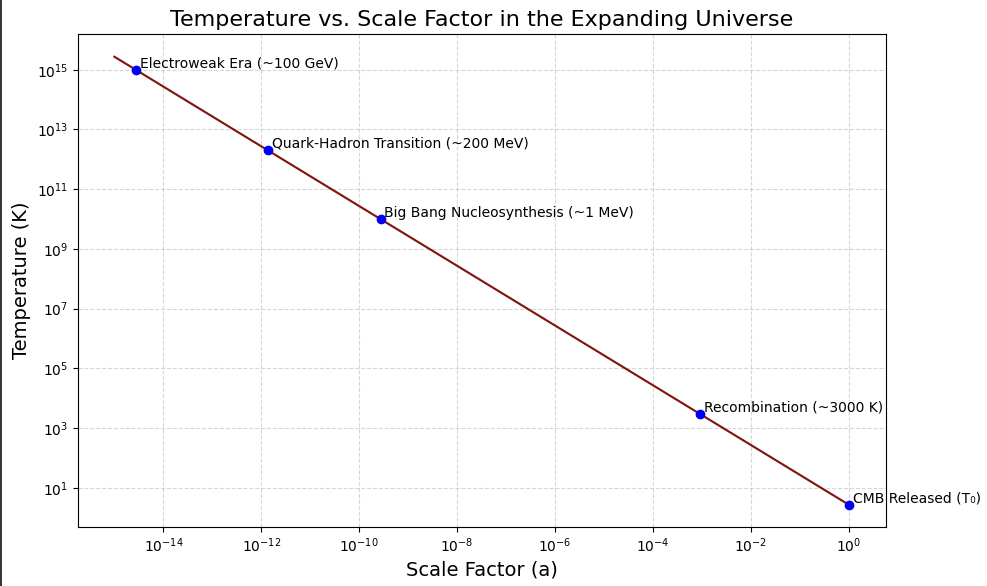

# Temperature vs. Scale Factor in the Expanding Universe

This simulation visualizes how the **temperature of the universe** evolves with respect to its **scale factor** during cosmic expansion. It follows the relationship  $T \propto \frac{1}{a}$, assuming adiabatic expansion of the universe, and highlights major thermal milestones from the **electroweak era** to the release of the **cosmic microwave background (CMB)**.

---

## 📈 Output



---

## 🧪 Key Thermal Milestones Plotted

| Epoch                         | Temperature      | Description                                   |
|------------------------------|------------------|-----------------------------------------------|
| Electroweak Era              | ~100 GeV (~10¹⁵ K) | When electroweak forces separated            |
| Quark-Hadron Transition      | ~200 MeV (~10¹³ K)| Quarks bound into protons and neutrons       |
| Big Bang Nucleosynthesis     | ~1 MeV (~10¹⁰ K)  | Formation of light nuclei (H, He, Li)        |
| Recombination Era            | ~3000 K           | Atoms formed, photons decoupled (CMB)        |
| CMB Released (Today)         | ~2.725 K (T₀)     | Present-day remnant radiation of the Big Bang|

---

## ⚙️ Physics Behind the Simulation

- **Adiabatic Expansion**: As the universe expands, it cools down due to redshifting of radiation.
- **Temperature-Scale Factor Relation**:  
 $$T(a) = \frac{T_0}{a}$$ 
  where:
  - $T_0 = 2.725 \, K$ (present-day CMB temperature)
  -  $a$ is the scale factor, normalized to 1 today.
- This assumes the universe is radiation-dominated and expands adiabatically (no heat loss or gain from outside the system).

---

## 🧠 Insights

- The simulation shows a **log-log** plot of temperature vs. scale factor.
- Thermal events are annotated at their approximate corresponding temperatures and scale factors.
- It provides an intuitive picture of how incredibly hot and dense the early universe was.

---

## 🗂️ File Structure

```
temperature-vs-scale-factor-in-expanding-universe/
│
├── temperature-vs-scale-factor-in-expanding-universe.ipynb         # Main simulation script
├── temperature-vs-scale-factor-in-expanding-universe.png           # Output plot image
└── README.md                              # This file
```

---

## 📚 References

- Weinberg, S. *The First Three Minutes*
- Kolb & Turner, *The Early Universe*
- NASA / WMAP Timeline: https://map.gsfc.nasa.gov/universe/bb_timeline.html

---

## 🪪 License

This project is licensed under the [MIT License](../LICENSE).

---
```
