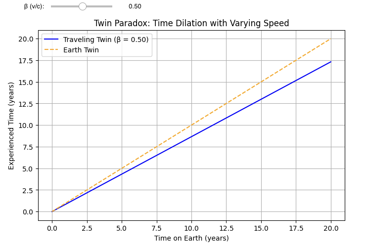

# Twin Paradox Simulation with Interactive Slider

This simulation visualizes the famous Twin Paradox scenario from special relativity using an interactive plot. One twin remains on Earth, while the other travels at a high speed and returns. The simulation dynamically shows how time dilation affects the traveling twin as their velocity increases.

## 🧠 What it Demonstrates

The Twin Paradox shows that a twin traveling at relativistic speeds ages more slowly than their sibling on Earth. This effect is due to **time dilation**, a key prediction of Einstein’s special relativity.

Using the interactive slider, you can adjust the traveling twin's speed and instantly see how their experienced time compares to Earth time.

## 🛠 Tools Used

- Python  
- Matplotlib  
- NumPy  
- ipywidgets (for the slider)

## 🚀 Features

- Interactive slider to control velocity as a fraction of the speed of light  
- Real-time plot update showing Earth frame time vs. experienced time  
- Simple yet powerful educational demonstration of time dilation

## 📷 Screenshot

## 🧪 How to Use

1. Clone the repository or download the notebook.  
2. Open `twin_paradox_slider.ipynb` in Jupyter or Google Colab.  
3. Use the slider to change the traveler's speed.  
4. Observe how the experienced time changes relative to Earth.

## 📌 Future Improvements

- Add return journey visualization  
- 3D or spacetime diagram visualization  
- Include acceleration phases for realism

## 📚 Related Concepts

- Time Dilation  
- Special Relativity  
- Lorentz Transformation  
- Spacetime Diagrams  

---
